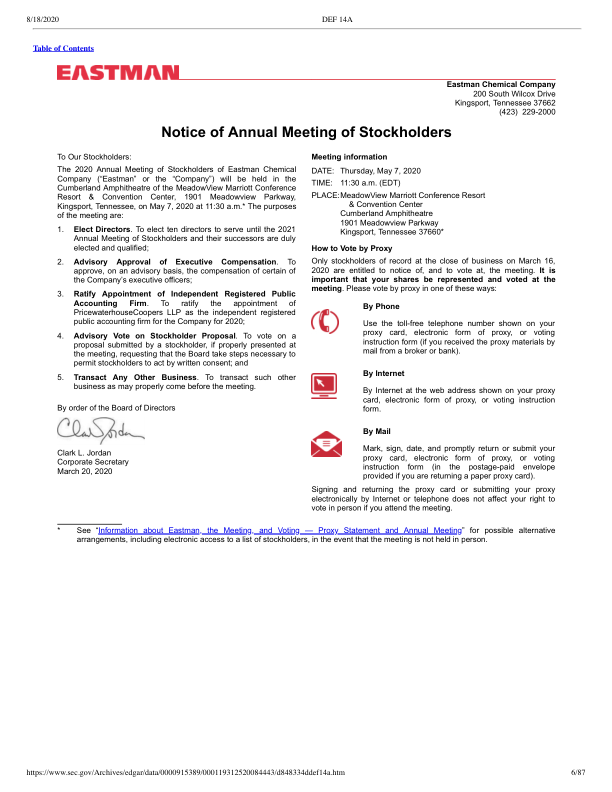
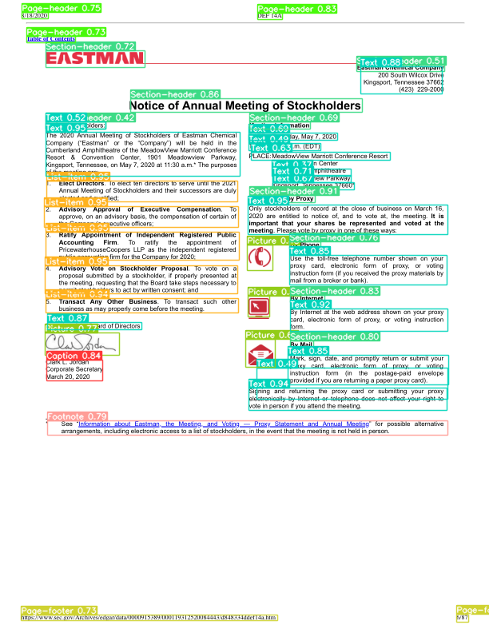
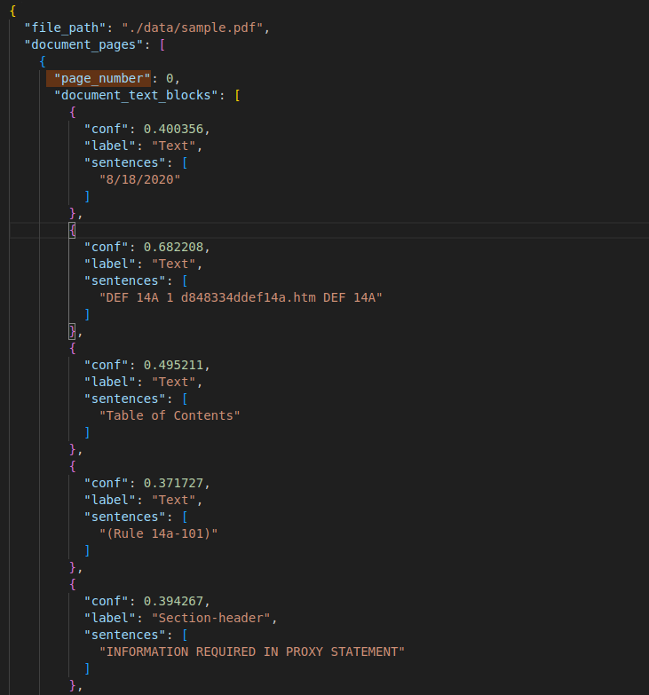

# Introduction
The Nipigon project performs "intelligent" text extraction from highly structured PDF documents. Traditional text extraction from PDFs often mix paragraphs with other text such as section headings, list items, or headers/footers. These issues are most pressing when extracting text from highly structure documents for example the page shown in Figure 1. Tables also present a signficant issue to tradiational extraction methods. The inclusion of such errors produces extracted text that is difficult to read and requires cleaning before use in downstream analysis steps such as when working with a Large Language Models.

|   |  
| ------------- |------------- |
| Figure 1: *Example of highly structured page*    | Figure 2: *Bounding boxes of detected document layout items*     |

 To prevent this the Nipigon project uses a fine-tuned verison of the Yolov5 object recognition model to identify various types of text blocks on the page. The Yolov5 model is able to identify the following types of text blocks in a document:
 
 1. Footnotes
 2. Formulas
 3. List-items
 4. Page-footers
 5. Page-headers
 6. Pictures
 7. Section-headers
 8. Tables
 9. Text
 10. Titles
 11. Captions

Once the text blocks on the page have been identified they care extracted into a JSON dictionary (example show in figure 3). The JSON dictionary breaks the document down into pages, which are further divied into text blocks. Each text block contains the following items:
| Key | Value |
| --- | --- |
| sentences | text extracted from text box |
| label (Footnote, text, title, etc.) | label given to text block by Yolov5 |
| confidence | confidence value between 0 and 1 assigned by Yolov5|

The JSON dictionary can then be used to extract only the text block types which are of interest to the user. For instance only paragraphs amd section headins could be extracted those removing formating and extraction issues caused by header/footers, tables, etc.

|   |     
| ------------- |
| Figure 3: *Example of the JSON dictionary generated by Nipigon*|

